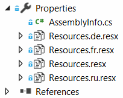
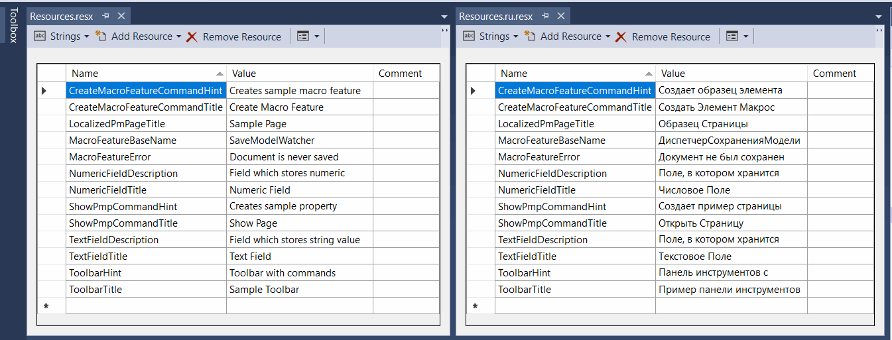

xCAD frameworks supports [resources in .NET applications](https://docs.microsoft.com/en-us/dotnet/framework/resources/index) to enable localization of the add-in, e.g. supporting multiple languages.

This technique allows to load localized string at runtime based on the Windows settings in the control panel.

{ width=300 }

Resources should be added to the corresponding localized .resx file (e.g. Resources.resx for default, Resources.ru.resx for Russian, Resources.fr.resx for French, etc.)

In order to reference the string from the resource, use the overloads of the constructors for the **TitleAttribute** and **SummaryAttribute** which allows to define title, tooltips, hint string for all elements across xCAD framework (i.e. menu commands, property page controls, macro feature, etc.)

Below is an example which demonstrates this technique. Text is localized as per resources below:

{ width=800 }

## Menu

Two commands in menu are localized for Russian and English versions of the add-in.

~~~ cs
[Title(typeof(Resources), nameof(Resources.ToolbarTitle))]
[Summary(typeof(Resources), nameof(Resources.ToolbarHint))]
public enum Commands_e
{
    [Title(typeof(Resources), nameof(Resources.ShowPmpCommandTitle))]
    [Summary(typeof(Resources), nameof(Resources.ShowPmpCommandHint))]
    ShowPmp,

    [Title(typeof(Resources), nameof(Resources.CreateMacroFeatureCommandTitle))]
    [Summary(typeof(Resources), nameof(Resources.CreateMacroFeatureCommandHint))]
    CreateMacroFeature
}
~~~

## Property Manager Page

Property Manager page title and tooltips for the controls are localized for Russian and English versions of the add-in.

~~~ cs
[Title(typeof(Resources), nameof(Resources.LocalizedPmPageTitle))]
public class LocalizedPmPage
{
    [Title(typeof(Resources), nameof(Resources.TextFieldTitle))]
    [Summary(typeof(Resources), nameof(Resources.TextFieldDescription))]
    public string TextField { get; set; }

    [Title(typeof(Resources), nameof(Resources.NumericFieldTitle))]
    [Summary(typeof(Resources), nameof(Resources.NumericFieldDescription))]
    public double NumericField { get; set; }
}
~~~

## Macro Feature

Macro feature base name is localized to Russian and English versions of the add-in.

> Note. Base name is only assigned while feature creation, feature won't be renamed after locale has changed.

In a similar way it is possible to use strings from the resources to return another data, e.g. text of the error for macro feature.

~~~ cs
[Title(typeof(Resources), nameof(Resources.MacroFeatureBaseName))]
[ComVisible(true)]
public class LocalizedMacroFeature : MacroFeatureEx
{
    protected override MacroFeatureRebuildResult OnRebuild(ISldWorks app, IModelDoc2 model, IFeature feature)
    {
        if (!string.IsNullOrEmpty(model.GetPathName()))
        {
            return MacroFeatureRebuildResult.FromStatus(true);
        }
        else
        {
            return MacroFeatureRebuildResult.FromStatus(false, Resources.MacroFeatureError);
        }
    }
}
~~~
